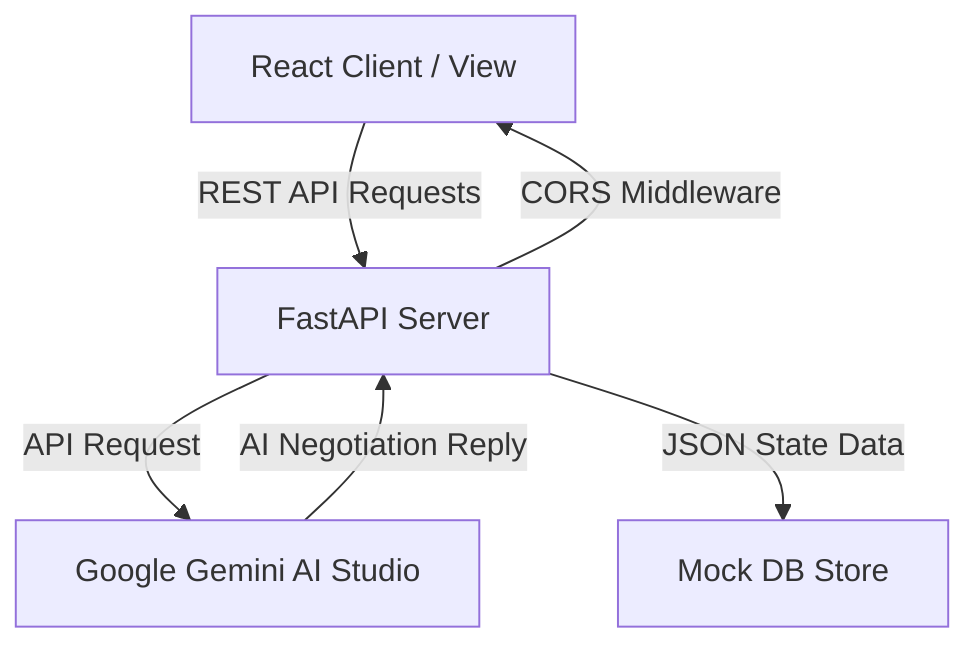

# 📋 SwapWear — Detailed Project Report
### *A Next-Generation Sustainable Clothing Exchange & Barter Marketplace*

---

## 📖 1. Executive Summary
**SwapWear** is a full-stack sustainable fashion marketplace designed to combat textile waste by facilitating peer-to-peer barter-style clothing exchanges. Instead of buying new clothes or struggling with second-hand reselling, users list wearable items they no longer need and swap them directly with other users for items of equivalent value. 

The platform features an interactive geographical interface for local swaps, a custom algorithmic value calculator to ensure fair trades, and a state-of-the-art **Google Gemini 2.0 AI-powered negotiation assistant** that helps barterers agree on swap details in real-time.

---

## ❓ 2. Problem Statement & Solution

### 🚨 The Problem
1. **Environmental Impact**: The fashion industry is responsible for 10% of global carbon emissions and millions of tonnes of landfill waste annually.
2. **Economic Inefficiency**: Millions of perfectly wearable garments sit unused in wardrobes because reselling is tedious, and donation centers are often overwhelmed.
3. **Lack of Barter Platforms**: Traditional e-commerce platforms (Amazon, eBay) focus strictly on monetary transactions, leaving a gap for zero-cost barter systems.

### 💡 The SwapWear Solution
SwapWear eliminates money from the equation:
* **True Barter System**: Users trade clothing items directly.
* **Smart Value Estimation**: Algorithmically estimates garment values based on brand, condition, and category.
* **Geographic Matching**: Visualizes listings on an interactive map to make local, low-carbon meetups simple.
* **AI-Assisted Negotiation**: Automates and guides swap negotiations via built-in Gemini LLM chat rooms.

---

## 🛠️ 3. Technology Stack

SwapWear is engineered using a robust, decoupled, and modern stack designed for high scalability and rapid development:

### ⚙️ Backend (API Layer)
* **Python 3.11+**: Core scripting and logic.
* **FastAPI**: Extremely fast, modern web framework for building REST APIs with auto-generated Swagger docs.
* **Uvicorn**: High-performance ASGI web server.
* **Pydantic**: Robust data validation and settings management.
* **Google Gemini AI (2.0 Flash)**: Powers the contextual chat negotiation agent.

### 🎨 Frontend (UI Layer)
* **React 18**: Component-based user interface architecture.
* **React Router v6**: Client-side single-page application (SPA) routing.
* **TailwindCSS & Craco**: High-performance utility-first CSS engine.
* **Framer Motion**: Smooth, premium micro-animations and transitions.
* **Leaflet & OpenStreetMap**: Full interactive maps without expensive commercial API key dependencies.
* **Lucide React**: Vector icon system.

---

## 🏗️ 4. System Architecture & Flows

### 🔄 Data Flow Architecture
The application separates concerns cleanly between presentation (React) and business logic (FastAPI):



### 👤 User Workflows
1. **Registration & Onboarding**: The user signs up, secures their password using SHA-256 hashing, and registers their home city.
2. **Item Listing & Valuation**:
   * User fills out brand, category, size, and condition.
   * The **Smart Valuation Algorithm** estimates the item's market value in INR.
   * User adds photos and saves the item.
3. **Browsing & Matchmaking**:
   * Users browse via the **Marketplace Grid** or toggle to the **Interactive Map View**.
   * The system presents **Nearby Matches** (same city) and **Fair-Value Matches** (item value within ±₹1200 difference) automatically.
4. **Swap Request & Negotiation**:
   * User proposes a swap, offering one of their own items in exchange.
   * They choose between **Local Meetup** or **Courier Shipping**.
   * A dedicated **Chat Room** opens where both parties can text. Gemini AI generates automated context-aware suggestions to speed up agreements.
5. **Finalization**: The receiver accepts the request, they complete the meetup, and mark the swap as **Completed**, updating their platform reputation index.

---

## 📊 5. Core Data Models

The system architecture utilizes four highly relational schemas:

### A. User Model
Tracks member identity, credentials, active location, and community swap reputation score:
```python
{
    "id": "str",
    "name": "str",
    "email": "str",
    "bio": "str",
    "location": "str",
    "role": "str",       # "user" | "admin"
    "status": "str",     # "active" | "banned"
    "swap_count": "int"
}
```

### B. Clothing Listing Model
Detailed metadata regarding listed garments, estimated cost, and status:
```python
{
    "id": "str",
    "title": "str",
    "description": "str",
    "category": "str",       # Tops, Bottoms, Dresses, Shoes, Accessories, etc.
    "brand": "str",
    "size": "str",
    "condition": "str",      # Like New, Excellent, Good, Fair, Poor
    "estimated_value": "int",# Calculated in INR
    "images": ["str"],       # List of image URLs
    "location": "str",
    "owner_id": "str",
    "status": "str"          # "available" | "swapped" | "removed"
}
```

### C. Swap Request Model
Captures transactional metadata of proposed clothing barters:
```python
{
    "id": "str",
    "requester_id": "str",
    "target_user_id": "str",
    "offered_listing_id": "str",
    "requested_listing_id": "str",
    "status": "str",          # "pending" | "accepted" | "rejected" | "completed"
    "delivery_method": "str", # "local_pickup" | "courier"
    "value_difference": "int",
    "match_score": "int",     # Percentage compatibility
    "eco_impact": "str"       # Calculated CO2 offset estimation
}
```

---

## 🤖 6. Google Gemini AI Integration

A core innovation in SwapWear is the **AI-powered Negotiation Assistant** integrated directly into the chat engine.

### How it Works:
1. When a user sends a message in a swap negotiation room, a background process is triggered.
2. The system pulls the swap context (e.g., *Red Nike Sneakers swapped for Blue Levi Jeans*) and the last 8 messages of chat history.
3. The prompt is packaged and sent to the **Gemini 2.0 Flash Model**:
   ```
   Prompt: "You are SwapWear's friendly AI chat assistant... Help users negotiate swaps, ask about size/condition/pickup, and keep replies short. Do not pretend to be the other user. Reply in 1-2 helpful sentences."
   ```
4. Gemini's response is appended as a live helpful hint in the chat interface.

### Benefits:
* **Speeds up transactions**: Prevents communication stalls.
* **Encourages Fair Exchange**: Highlights size and condition checks before swapping.

---

## 📈 7. Administrative & Analytical Controls

An advanced **Admin Panel** provides centralized monitoring to ensure platform safety and tracking of core Key Performance Indicators (KPIs):

* **KPI Monitoring Dashboard**: Tracks Total Users, Live Listings, Swaps Attempted, Completed Swaps, and Swap Success Rates.
* **Listing Moderation**: Allows admins to immediately flag and delete items violating standards.
* **User Management**: Restricts platform access by banning malicious/spam accounts.

---

## 🌍 8. Environmental Impact Assessment

SwapWear measures sustainability metrics directly in the UX to encourage circular fashion:
* **Carbon Offset Tracking**: Shows approximate CO₂ kilograms saved by recirculating used clothing instead of manufacturing new items.
* **Wardrobe Value Circulation**: Tracks the financial equivalent of active trades within the barter circle.

---

## 🔮 9. Future Roadmap & Scaling
* **Escrow Value Adjusters**: Secure online payment gateways to balance value differences (e.g., swapping a ₹500 shirt for a ₹1000 jacket + ₹500 cash).
* **AI Computer Vision**: Automatic brand, category, and quality estimation from uploaded photos.
* **Virtual Fitting Room**: Augmented Reality (AR) integration to let users virtually try on clothes.
* **Shipping Courier APIs**: Integration with live shipping APIs for automated printing of postal labels.

---

<div align="center">

### **SwapWear: Swap Smart. Wear Sustainably. Waste Nothing.**

*Designed and Developed for circular economies and zero-emission fashion.*

</div>
